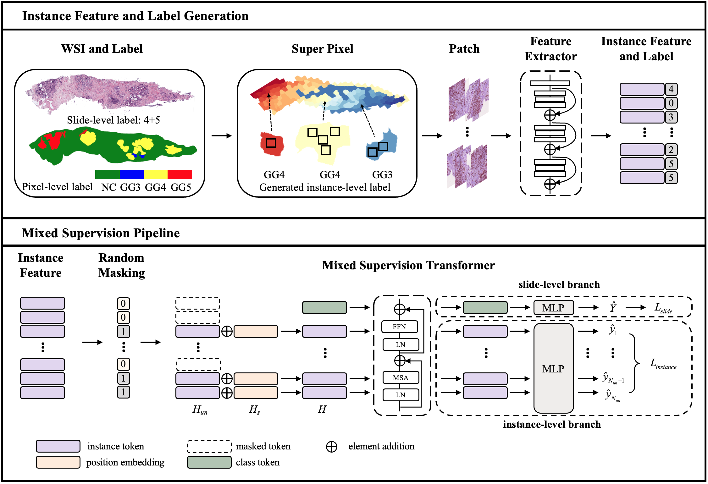

# Multiple Instance Learning with Mixed Supervision in Gleason Grading
<details>
<summary>
    <b>Multiple Instance Learning with Mixed Supervision in Gleason Grading</b>, MICCAI2022. <a href="https://arxiv.org/abs/2206.12798v1" target="blank">[arXiv]</a>
</summary>

```tex
@article{bian2022multiple,
  title={Multiple Instance Learning with Mixed Supervision in Gleason Grading},
  author={Hao Bian, Zhuchen Shao, Yang Chen, Yifeng Wang, Haoqian Wang, Jian Zhang, Yongbing Zhang},
  journal={arXiv preprint arXiv:2206.12798v1},
  year={2022}
}
```

**Abstract:** With the development of computational pathology, deep learning methods for Gleason grading through whole slide images (WSIs) have excellent prospects. Since the size of WSIs is extremely large, the image label usually contains only slide-level label or limited pixel-level labels. The current mainstream approach adopts multi-instance learning to predict Gleason grades. However, some methods only considering the slide-level label ignore the limited pixel-level labels containing rich local information. Furthermore, the method of additionally considering the pixel-level labels ignores the inaccuracy of pixel-level labels. To address these problems, we propose a mixed supervision Transformer based on the multiple instance learning framework. The model utilizes both slidelevel label and instance-level labels to achieve more accurate Gleason grading at the slide level. The impact of inaccurate instance-level labels is further reduced by introducing an efficient random masking strategy in the mixed supervision training process. We achieve the state-of-the-art performance on the SICAPv2 dataset, and the visual analysis shows the accurate prediction results of instance level.

</details>





## Data Preprocess
[SICAPv2 dataset](https://data.mendeley.com/datasets/9xxm58dvs3/1) is a database containing prostate histology whole slide images with both annotations of global Gleason scores and path-level Gleason grades. 
We follow the data process pipeline of [SegGini-MICCAI 2021](https://github.com/histocartography/seg-gini). We provide the processed data (containing extracted instance feature, slide-level and generated instance-level labels).
Download the [processed_data](https://drive.google.com/file/d/1KPZ8ikuboxdr79_H895CCHLQVYiDv0LV/view?usp=sharing) and then put them into the `data/SICAPv2`. The form is as follows:
```bash
data
└── SICAPv2
    ├── 16B0001851.bin
    ├── 16B0003388.bin
    :
    ├── 18B0006623J.bin
    └── 18B001071J.bin

```
## Installation
```bash
# create and activate the conda environment
conda create -n mixed_supervision python=3.7 -y
conda activate mixed_supervision

# install pytorch
pip install torch torchvision --extra-index-url https://download.pytorch.org/whl/cu113

# install related package
pip install -r requirements.txt
```
## Train & test
### Basic, Fully Automated Run
```bash
CONFIG_FILE=configs/SICAPv2.yaml
GPU=0
bash run.sh $CONFIG_FILE $GPU
```

### Tow-Step run
- Train (i.e., train the fold0 model): 
```bash
CONFIG_FILE=configs/SICAPv2.yaml
GPU=0
python main.py --config $CONFIG --stage train --gpus $GPU --fold $fold
```

- Test (i.e., test the fold0 model): 
```bash
CONFIG_FILE=configs/SICAPv2.yaml
GPU=0
python main.py --config $CONFIG --stage train --gpus $GPU --fold $fold
```

- Statistical results of 4-folds cross-validation
```bash
CONFIG_FILE=configs/SICAPv2.yaml
python metrics.py --config $CONFIG 
```


## Acknowledgements, License & Usage
- This work is an extension of our [TransMIL](https://github.com/szc19990412/TransMIL) in mixed-supervision scenarios. Our implementation also refers several existing publicly available code. Thanks for their excellent work.
  - [LV-VIT ](https://github.com/zihangJiang/TokenLabeling)
  - [SegGini-MICCAI 2021](https://github.com/histocartography/seg-gini)
  - [CLAM-Nature Biomedical Engineering 2021](https://github.com/mahmoodlab/CLAM)
- If you found our work useful in your research, please consider citing our works(s) at:


```tex

@article{shao2021transmil,
  title={Transmil: Transformer based correlated multiple instance learning for whole slide image classification},
  author={Shao, Zhuchen and Bian, Hao and Chen, Yang and Wang, Yifeng and Zhang, Jian and Ji, Xiangyang and others},
  journal={Advances in Neural Information Processing Systems},
  volume={34},
  pages={2136--2147},
  year={2021}
}

@article{bian2022multiple,
  title={Multiple Instance Learning with Mixed Supervision in Gleason Grading},
  author={Hao Bian, Zhuchen Shao, Yang Chen, Yifeng Wang, Haoqian Wang, Jian Zhang, Yongbing Zhang},
  journal={arXiv preprint arXiv:2206.12798v1},
  year={2022}
}

```
© This code is made available under the GPLv3 License and is available for non-commercial academic purposes.